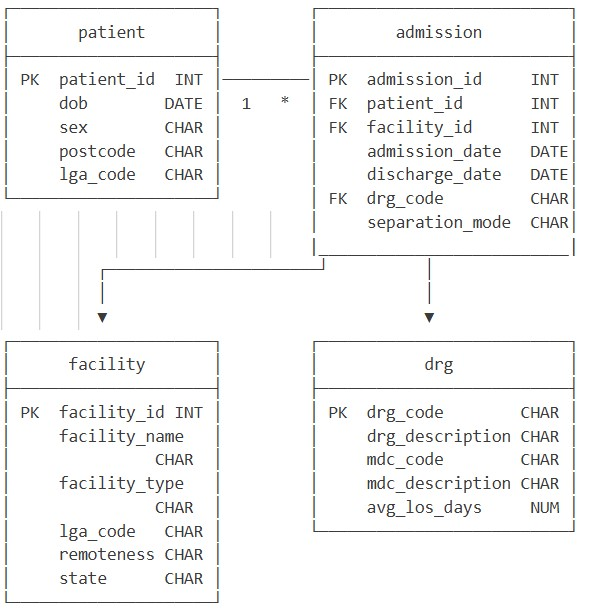

```{r set-options, echo=FALSE, cache=FALSE}
options(width = 150)
```

## TASK ONE – Data wrangling, ETL, and communication

See the commented R code below for ingesting the provided `ABS_death_australia_remotenessareas.xlsx` file.

```{r, results=FALSE, message=FALSE}
library(readxl)
library(stringr)
library(dplyr)
library(tidyr)
library(purrr)
library(zoo)
library(ggplot2)


## variables for simplifying following import script
## file name
abs_file <- "input/ABS_death_australia_remotenessareas.xlsx"
## sheet name
sheet_name <- "Table 1"
### cell range of column header rows
header_range <- "B7:BS9"
### cell range of row labels
row_label_range <- "A10:A78"
### cell range of content data
content_range <- "B10:BS78"


## import the content data, and hold-off further processing for now
### everything imported as text so no detail lost
abs_remote_content <- read_excel(abs_file, sheet=sheet_name, col_names=FALSE, col_types="text", range=content_range)


## import and process column header rows to generate column names
abs_remote_colnames <- read_excel(abs_file, sheet=sheet_name, col_names=FALSE, range=header_range)
### fill in merged cell values so year value repeated for every column
abs_remote_colnames[1,] <- as.list(na.locf(unlist(abs_remote_colnames[1,])))
### collapse to a delimited string using an uncommon delimited which can be later used to split out components
abs_remote_colnames <- map_chr(abs_remote_colnames, paste, collapse="^")


## import and process the row labels
abs_remote_rownames <- read_excel(abs_file, sheet=sheet_name, col_names=FALSE, range=row_label_range)
### add first column of the content data to identify completely blank rows which are sub-headings
### and make the names nicer
abs_remote_rownames <- abs_remote_rownames %>%
    bind_cols(abs_remote_content[[1]]) %>%
    set_names(c("label","tmp_value"))
## find the NAs, move the second-order label to the next row for use later
nas_rownames <- which(is.na(abs_remote_rownames$tmp_value))
abs_remote_rownames$label_group <- NA
abs_remote_rownames$label_group[nas_rownames + 1] <- abs_remote_rownames$label[nas_rownames]


## incorporate it all together
### join the row labels and the content, after naming the content data
abs_remote <- abs_remote_rownames %>%
    bind_cols(abs_remote_content %>% set_names(abs_remote_colnames))

### drop the NA rows for second-order label and roll values forward
### drop the helper variable
abs_remote <- abs_remote %>%
    filter(!is.na(tmp_value)) %>%
    mutate(label_group = na.locf(label_group)) %>%
    select(-tmp_value)
### make some nicer names for the row labels variables
nice_row_labels <- c("remoteness"="label", "state"="label_group")
abs_remote <- abs_remote %>%
    rename(all_of(nice_row_labels))

## pivot the table to long to make it tidy
## clean up NA values and ensure numberic variables are numeric
## only keep the non-aggregated core remoteness categories
## make sure that the remoteness category is properly ordered
remoteness_levels_ordered <- c("Major Cities", "Inner Regional", "Outer Regional", "Remote", "Very Remote")
abs_remote_long <- abs_remote %>%
    pivot_longer(cols=-c(remoteness,state)) %>%
    separate_wider_delim(cols=name, delim="^", names=c("year","measure","value_type")) %>%
    mutate(na_value = if_else(suppressWarnings(is.na(as.numeric(value))), value, NA)) %>% 
    mutate(value = na_if(value, "np")) %>%
    mutate(value = as.numeric(value)) %>%
    mutate(year = as.integer(year)) %>%
    filter(remoteness %in% remoteness_levels_ordered) %>%
    mutate(remoteness = ordered(remoteness, levels=remoteness_levels_ordered))

## write out the final csv file
write.csv(abs_remote_long, "output/abs_deaths_remoteness_2011_2024.csv", row.names=FALSE)
```

This produces a cleaned, long-form ('tidy') dataset, as shown in the below sample, with correct variable types for numeric, ordinal and nominal (character) types:

```{r}
head(abs_remote_long)
```

### Interpretation

The standardised death rate available in this provided dataset is the standard reporting measure used by the ABS for reporting trends in Deaths (see https://www.abs.gov.au/statistics/people/population/deaths-australia/latest-release ), which takes into account a standardised population in the reporting area (as at 2001). As all deaths are considered in this measure, it is the most appropriate to use for a general comparison over time and region. Figure 1 below presents the mean of all standardised death rates for the period 2013-2024, by ABS Remoteness Area (ARIA), for both Australia overall and Queensland separately. 

```{r, fig.dim=c(8, 4), fig.cap="***Figure 1***: *Mean Standardised Death Rate by Remoteness, 2013-2024, Queensland and Australia*"}
abs_remote_long %>%
    filter(state %in% c("Queensland","Australia"), measure == "Standardised death rate", year >= 2013) %>%
    ggplot(aes(x=remoteness, y=value, fill=state)) +
    stat_summary(fun.y="mean", geom="col", width=0.7, position=position_dodge()) +
    stat_summary(fun.data = mean_se, geom = "errorbar", width=0.5, position=position_dodge(width=0.7)) +
    xlab("Remoteness") +
    ylab("Mean Standardised Death Rate") +
    labs(fill="Region") +
    theme_bw()
```

There is a general pattern that standardised death rates increase as the level of remoteness increases, and this pattern holds true for both Australia as a whole and Queensland individually across the available data. There is not significant variation in rates contributing to each mean value. While death rates in more urban Remoteness Areas (Major Cities, Inner Regional, Outer Regional) appear to be roughly comparable between Queensland and Australia, the standardised death rate in Remote, and particularly Very Remote regions for Australia as a whole appears higher than the rate for Queensland. Figure 2 expands on the overall analysis shown in Figure 1. It presents the standardised death rates for both Australia and Queensland for the period 2013-2024, with the individual values for each Remoteness Area presented as a time-series. 

```{r, fig.dim=c(10,5), fig.cap="***Figure 2***: *Standardised Death Rate by Remoteness and Year, 2013-2024, Queensland and Australia*"}
abs_remote_long %>%
    filter(state %in% c("Queensland","Australia"), measure == "Standardised death rate", year >= 2013) %>%
    ggplot(aes(y=value, x=year, col=state)) +
    geom_line() +
    facet_grid(cols=vars(remoteness)) +
    xlab("Year") +
    ylab("Standardised Death Rate") +
    scale_x_continuous(breaks=c(2013:max(abs_remote_long$year))) +
    labs(col="Region") +
    theme_bw() +
    theme(legend.position="bottom", axis.text.x = element_text(angle = 90))
```
Figure 2 confirms the consistency of the pattern from Figure 1 that standardised death rates increase as remoteness increases, despite some variation from year-to-year within each Remotness Area. As with Figure 1, the temporal trends in standardised death rates track similarly across the available data for Major Cities, Inner Regional and Outer Regional areas. The rate for Australia as a whole was consistently higher in the earlier years from 2013-2015 in the Remote region, but has been comparable since. Picking up on the key finding from Figure 1, it can be seen that the standardised death rate in the Very Remote region for Australia as a whole diverged from that of Queensland in 2016, and has remained consistently higher through to 2024. This appears to be driven by a consitent decrease in the standardised death rate in Queensland from 2013-2024 while the rate for Australia as a whole has fluctuated around the 2013 value across the same period.

### Reflection Question

*If this pipeline were to run automatically each time a new annual release was published by the ABS, what aspects of your current code would be fragile or likely to break, and how would you address them?*

The current import script has a number of weaknesses. The row, column, and content data ranges are hard-coded at the top of the script. While this allows for relatively simple adjustment in the future in only one location, formatting changes to the Excel file would require these to be manually checked against the structure of an updated file. There may be a possibility of using other packages (e.g. `tidyxl`) which allow for importing xlsx formatting information, to infer data and dimension names directly without human intervetion.

The colnames assignment should be relatively robust in general, though the use of a text delimiter to later split out the components may be more appropriately addressed by using a formal list(...) of the different heading levels. This would reduce the risk of the unlikely inclusion of the delimiter breaking the entire logic of this code section.

The rownames assignment likewise relies on blank/NA values in the content data to determine state break-points. This could easily be broken by the removal of white-space in the formatting of the Excel sheet, and the pattern in the row label's 'Total' values may serve as a less-likely-to-break point of reference.

The handling of all data as text initially is also a possible point of failure due to potential loss of precision during import. Ways to import each cell of data individually without altering its content may be worth considering. Again, the `tidyxl` package may support this functionality, albeit at the cost of losing some simplicity in importing the data.

Ultimately, looking for alternative solutions rather than working with poorly-structured spreadsheets may be more appropriate in the long-term. The ABS is now offering an API to some datasets (https://www.abs.gov.au/about/data-services/application-programming-interfaces-apis/data-api-user-guide/using-api), and this may be investigated to see if it is workable for this particular data source.


## TASK TWO – Function Writing & Code Quality

See below the creation of a function that converts the standard ABS Remoteness Regions/ARIA to an ordered factor on the Urban to Rural continuum, for use in future reporting and plotting which would expect this order.
It has been requested that *"The function should accept a data frame as input, return a dataframe (with the renamed column), and otherwise exhibit best practices for function writing."*

The `remote_to_factor_data` function takes several inputs:

    data:          a data.frame or compatible object to be altered.
    var:           the variable/column in the supplied data to be recoded to a factor or ordered factor.
    outvar:        the name of a new variable/column to be created in the supplied data, holding the
                   output of the recoding.
    remote_levels: the remoteness levels to be specified, defaulting to ABS/ARIA classifications in
                   urban-to-rural order
    ordered:       a logical (TRUE/FALSE) value indicating if the output of the recoding should be a
                   standard or ordered factor.
		   
```{r}
remote_to_factor_data <- function(
                                  data=NULL,
                                  var=NULL,
                                  outvar=NULL,
                                  remote_levels=c("Major Cities", "Inner Regional", "Outer Regional",
				                  "Remote","Very Remote"),
                                  ordered=TRUE
                                  ) {
    ## error checking
    if(!inherits(data, "data.frame")) {
        stop("A data.frame or compatible object to be altered must be supplied as the data= argument.")
    } else if(!(is.character(var) && length(var) == 1)) {
        stop("A var= argument of a character vector of length 1 must be provided.")
    } else if(is.null(data[[var]])) {
        stop("Name of column to be altered (var= argument) must be present in data specified as the data=argument.")
    } else if(!(is.character(outvar) && length(outvar) == 1)) {
        stop("An outvar= argument of a character vector of length 1 must be provided.")
    } else if(!(is.character(remote_levels) && length(remote_levels) >= 1)) {
        stop("A remote_levels= argument of a character vector of at least length 1 must be provided.")
    } else if(!(is.logical(ordered) && length(ordered) == 1)) {
        stop("An ordered= argument of a logical (TRUE/FALSE) vector of length 1 must be provided.")
    }
   ## output the new variable and return the modified data
    data[[outvar]] <- factor(data[[var]], levels=remote_levels, ordered=ordered)
    data
}
```

Confirm the function works in typical use cases, and that the results are valid and as expected:

...With a character variable as a typical use case:

```{r}
tmp <- remote_to_factor_data(
    data = abs_remote_long %>% mutate(remoteness = as.character(remoteness)),
    var = "remoteness", outvar = "remoteness_ordered"
)
levels(tmp$remoteness_ordered)
unique(tmp$remoteness_ordered)
table(tmp$remoteness, tmp$remoteness_ordered)
```

...with a variable that is already a factor/ordered:

```{r}
tmp <- remote_to_factor_data(
    data = abs_remote_long,
    var = "remoteness", outvar = "remoteness_ordered"
)
levels(tmp$remoteness_ordered)
unique(tmp$remoteness_ordered)
table(tmp$remoteness, tmp$remoteness_ordered)
```

...with a customised (reverse) levels order:

```{r}
tmp <- remote_to_factor_data(data = abs_remote_long, var = "remoteness", outvar = "remoteness_ordered",
                             remote_levels = rev(c("Major Cities", "Inner Regional", "Outer Regional", "Remote", "Very Remote")))
levels(tmp$remoteness_ordered)
unique(tmp$remoteness_ordered)
table(tmp$remoteness, tmp$remoteness_ordered)
## correctly reverses order of levels as specified without changing values directly
```

Confirm the function fails when it should fail, including when arugments are not specified, or not specified properly:

Test not specifying each required variable and confirm failure:  
remote_levels= and ordered= arguments have default values, so will not fail this simple test.

```{r, error=TRUE}
remote_to_factor_data(var = "remoteness", outvar = "remoteness_ordered")
remote_to_factor_data(data = abs_remote_long, outvar = "remoteness_ordered")
remote_to_factor_data(data = abs_remote_long, var = "remoteness")
```

Test proper specification of remote_levels= argumment to ensure fails when it should:
```{r, error=TRUE}
remote_to_factor_data(data = abs_remote_long, var = "remoteness", outvar = "remoteness_ordered",
                      remote_levels = TRUE)
```

Should succeed, but return NA when unspecified levels are not in the data:

```{r, error=TRUE}
tmp <- remote_to_factor_data(data = abs_remote_long, var = "remoteness", outvar = "remoteness_ordered",
                             remote_levels = c("Major Cities", "other", "not present", "levels"))
levels(tmp$remoteness_ordered)
unique(tmp$remoteness_ordered)
table(tmp$remoteness, tmp$remoteness_ordered)
```

Test specifying input variable that is not present:

```{r, error=TRUE}
remote_to_factor_data(data = abs_remote_long, var = "not_present", outvar = "remoteness_ordered",
                      ordered = TRUE)
```		      

Test proper specification of ordered= argument, to ensure returns order or factor variable, and fails when not a single logical input:

```{r, error=TRUE}
tmp <- remote_to_factor_data(data = abs_remote_long, var = "remoteness", outvar = "remoteness_ordered",
                      ordered = TRUE)
class(tmp$remoteness_ordered)		      

tmp <- remote_to_factor_data(data = abs_remote_long, var = "remoteness", outvar = "remoteness_ordered",
                      ordered = FALSE)
class(tmp$remoteness_ordered)

remote_to_factor_data(data = abs_remote_long, var = "remoteness", outvar = "remoteness_ordered",
                      ordered = "TRUE")

remote_to_factor_data(data = abs_remote_long, var = "remoteness", outvar = "remoteness_ordered",
                      ordered = c(TRUE,FALSE))
```


## TASK THREE – Databases / SQL

```{r , echo=FALSE, out.width = 604}

```


<ul>*Q1. In this schema, patient.lga_code and facility.lga_code both reference a Local Government Area, but there is no formal LGA lookup table in the database. What are the risks/consequences of this design decision, and what would you do about it in an analytical context?*</ul>

Only a formal look-up table of standard Local Government Area (LGA) codes as available from the Australian Bureau of Statistics (ABS) would serve as a complete source of truth for reporting purposes. Relying on the `lga_code`s which are present in either the `patient` or `facility` table, or even the union of codes in both tables, may not necessarily capture all valid values. Firstly, this presents a possibility that LGA codes recorded in either the `patient` or `facility` tables may not be valid Local Government Area codes conforming to the ABS standard. Secondly, there may be LGA codes present in the ABS standard which are not present in the captured admissions data.

The fact that the `patient` table and `facility` tables both record an LGA which can be associated with an event is likely not a contradiction. Typically databases with this structure for hospital admissions data would record the patient LGA of their usual residence, while the facility LGA represents the physical location of the hospital where care was provided.

The structure of this admissions data has several implications for reporting. Presenting counts or rates by either `facillity` or `patient` LGA would ignore any LGAs which are not represented in the `patient` or `facility` tables. e.g. - reporting on rates of a rare condition by population would not correctly consider LGAs which have no reported cases. LGA values which are not frequently occurring, or which appear to not be formatted similarly to other values in the set, should be scrutinised to ensure they have been accurately recorded. Ideally, (outer) joins against an appropriately-sourced reference table of LGAs should be included as part of a workflow for any analyses using this database, so that a full and accurate set of LGAs which could possibly be represented are considered.


<ul>*Q2. An epidemiologist who runs queries against this database to filter admissions by admission_date reports to you that her queries are running slowly on a table with 5 million rows. What could you do to speed up these queries and why?*</ul>

Depending on the type of database in which these tables are stored, there may be varying solutions. Examining the explain plan of the query may immediately identify bottlenecks in particular queries which could be adjusted. For example, any join criteria as part of the query should be examined to ensure that 1:1 and Many:1 joins are occurring as expected, and any unintended duplication of data is not occurring in either the joins or the final returned results. Admission date is already a correctly specified date column type, so there should be no need to adjust the structure of the `admission` table. As the table is only a moderately-large 5 million rows, an index could be added against the `admission_date` variable in the `admission` table, without incurring a large one-off execution time or storage penalty. This would provide a likely immediate improvement for all future queries.
If the filtering of admissions is using standard reporting cut-offs such as years, financial years, or months which are extracted from `admission_date` dynamically (e.g. in where statements), then developing a separate look-up table which records all dates, along with pre-calculated columns for routine date components would allow date comparisons to occur using static rather than dynamic values which need to be calculated at execution time for each query.
    

<ul>*Q3. If you were asked: “How many admissions in 2023 occurred in Very Remote Queensland facilities?” Conceptually, outline which tables are involved and what considerations would you need to be careful about? (No need to write SQL — just explain your reasoning).*</ul>

The `admission` table presumably contains a single row for each admission, including details such as the `admission_date`. A `year` indicator could be extracted from the `admission_date` in this table to allow subsetting directly to 2023, or a selection range on `admission_date` could be directly specified for all admissions from 1st January to 31st December 2023. The `facility` table contains facility-level information such as the type and location of each facility, including its associated `remoteness` area. A join between the `admission` table and `facility` table on the `facility_id` key would therefore be central to a query combining `admission_date` and corresponding `remoteness` details. 

The database tables are described as representative of that in a '*state health department*', presumably Queensland in this case. When joining to the facility table, the join criteria should not only consider the match between the foreign_key-to-primary_key on `facility_id`, but also limiting the join on the `state` variable, the existence of which suggests that the `facility` table may include records for other states which may share the same `facility_id` as Queensland-based facilities. All joins from the admission table to facility table should initially be left/outer joins, to account for the potential circumstance of errors in recording of a `facility_id` in the admission table, or actual facilities that may not be represented in the facility table for whatever reason (e.g. an out of date reference table).

Once a satisfactory join can be establised between the `admission` and `facility` tables, a simple count can be selected where the `admission.admission_date` occurred in 2023, and the associated `facility.remoteness` was 'Very Remote.'


## TASK FOUR – Git / Bash / SysAdmin

<ul>*Q1. A colleague runs git status and sees the following output:*

    On branch main
    Changes not staged for commit:
      modified:   R/clean.R
    
    Untracked files:
      data/raw/new_file.csv


*They run git commit -m "update cleaning script" immediately. What happens?*</ul>

The `new_file.csv` file which is not being tracked for version control will be ignored entirely, as it is not part of the git repository at all.
The modified `R/clean.R` file, which appears to be the target of the `git commit` call, given the related `"update cleaning script"` commit message, will not have its changes committed to the git repository. Other changes which were staged for commit may be committed to the repository (though it looks like there are none currently), but not the intended file.


<ul>*Q2. You are on branch feature/new-plot and run git merge main. Git reports a merge conflict in the script R/analysis.R. What is the the right course of action?*</ul>

Merging the `main` branch against the working `new-plot` branch will attempt to merge code which currently exists on the `main` branch against the current working copy stored in `new-plot`. As this means that changes already committed on the `main` branch now conflict with your working branch, these conflicts must be resolved on the 'new-plot' branch first before continuing making changes to the codebase.


<ul>*Q3. You are one of three data scientists collaborating on an analytical pipeline in a shared GitHub repository. Describe the branching and pull request workflow you would follow to add a new feature (e.g. a new visualisation function in R/plots.R) without disrupting your colleagues’ work on main.*</ul>

A typicaly workflow for this scenario would be:
- make a new `working` branch to hold the code to be edited for R/plots.R
- fetch and merge the existing code from `main` into the `working` branch so you have a clean, up-to-date and agreed codebase to build upon.
- make changes to the `working` branch code and commit them regularly to the `working` branch.
- repeat the fetch and merge from `main` regularly to ensure any code conflicts can be resolved while developing.
- when significant work has been undertaken and the local `working` code is ready to be potentially merged back to `main`, push the `working` branch back to the remote repository
- raise a pull request so that the `working` branch code can be reviewed by the other team members before being rejected, returned for further editing, or merged into the `main` branch


<ul>*Q4. A colleague has accidentally committed a file containing a database password (config/db_credentials.R) and pushed it to the remote main branch. Describe the steps you would take to remediate this situation.*</ul>

I am not confident outlining a full solution to this problem that would 100% resolve security concerns.
I would first consider any associated credentials included in `db_credentials.R` to be potentially compromised, and arrange to change all passwords.
Then I would take a full local `git clone` backup of the remote repository (possibly stored in several locations) to ensure no data is lost.
All members of the team who may be currently working on code to eventually be integrated to the `main` branch should be notified to temporarily pause any planned code merges, to prevent possible future issues.
I understand that simply removing the file and pushing the changes to the remote main branch would only obscure the credentials within the commit history of the remote repository, and a wider-ranging response would be required. From my research, the git project explicitly recommends using `git filter-repo` as listed here on the official documentation - https://git-scm.com/docs/git-filter-branch#_warning .

There are tutorials available online ( https://www.tutorialpedia.org/blog/how-to-remove-file-from-git-history/ ) which walk through the process to explicitly remove all mentions of the file from both the current repository, previous commits and all history and possible hidden files. Following this proceess may mitigate most of the risk.

<ul>*Q5. A colleague runs ls -l and sees the following for a script file:*

    -rwxr-x--- 1 jsmith analysts 4096 Feb 10 09:32 run_pipeline.sh

*Describe the permissions on this file?*</ul>

The file is not a directory (no 'd' at the start of the permissions string). The current user can read, write and execute the shell script, users within the file's group can read and execute the script, and all other users can neither read, write nor execute the script (chmod 750). So long as the current user remains logged in to this account, they should have full privileges to work with this file.

<ul>*Q6. A new analyst joins your team. They have attempted to run a script that lives in /our_team_server/shared/run_analysis.R and they receive a Permission denied error. Explain how you would go about diagnosing and solving the issue here.*</ul>

It is not clear from the question at what point the 'Permission denied' error is being returned.
Permission denied errors in R usually refers to the user, or potentially the program from which the user is calling the script (R/RStudio or another IDE), not having appropriate permissions to access the directory containing the file, or the file specifically. If the error only occurs *during* successful execution of the script however, it may be that the code contained in `run_analysis.R` is attempting to access a file or directory in a way in which the user is not permitted to do so. Once it is established which location/file is not able to be accessed, several possible steps could be taken to pinpoint this issue:

- checking the user is signed in with their standard account which should normally have access to the file and directory. If not, logout and login as the required user.
- checking the users's permissions for the `/our_team_server/shared` folder and the `run_analysis.R` file and ensuring they have the appropriate access permissions. Change file permissions if required.
- checking that the user can access the file simply using another program (e.g. a text editor), to eliminate the possibility of a fault in the proram's configuration preventing access. If so, confirm the intended program is running with enough privileges to access the file.
- ensuring another user with access to the file does not have it locked for editing. If so, ask the other user to close the file if they can be identified.
- ensuring another process or program is not running, either locally to the user, or by another user, which has locked the file. If so, ask the user responsible for the process to either stop the process, or inform the user when it has completed and relinquished access.


